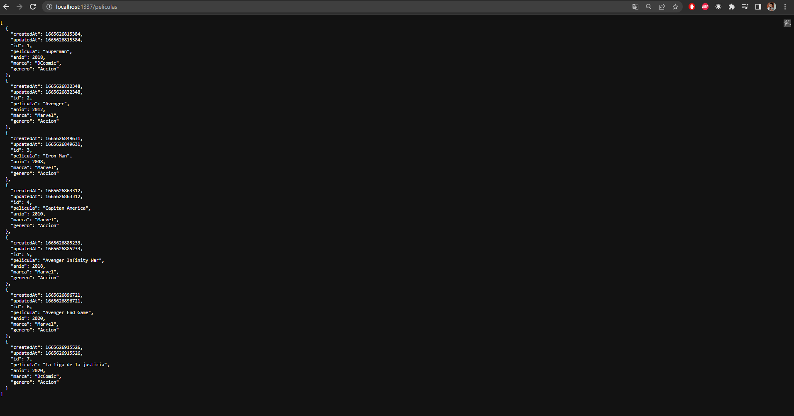

# Desafio Framework Salis

## Rutas (POSTMAN)

- Listar Peliculas

    http://localhost:1337/peliculas - GET

- Agregar una pelicula

    http://localhost:1337/peliculas - POST
- Seleccionar una pelicula en especifico

    http://localhost:1337/peliculas/find/ID (Ingrese el id de la pelicula) - GET
- Editar una pelicula

    http://localhost:1337/peliculas/ID (Ingrese el id de la pelicula) - PUT

- Eliminar una pelicula

    http://localhost:1337/peliculas/ID (Ingrese el id de la pelicula) - DELETE